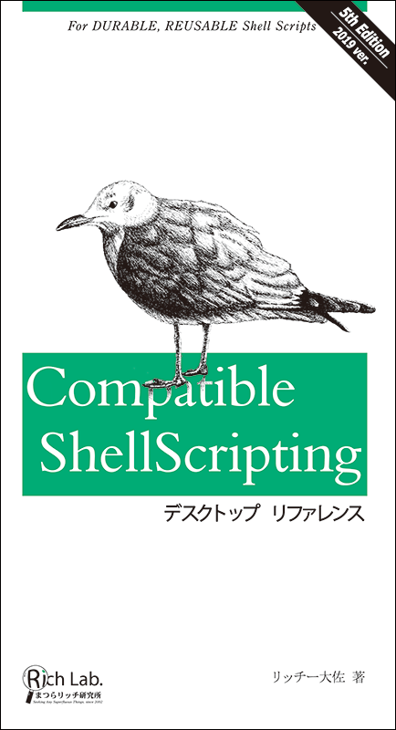
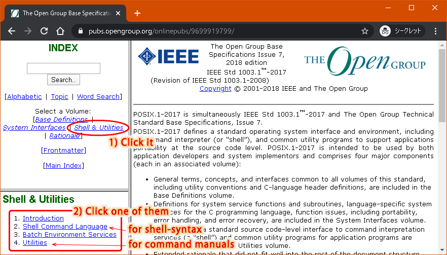

# Knowledge to Make Shell Scripts More Compatible

This is the translation project for [Compatible ShellScripting](https://richlab.org/coterie/csp.html) written in Japanese.

**The translation is about 30% done.**

# Preface

## Shell Script Compatibility is Up To You

Many programmers regard that shell script is a single-use script language because there are many dialects among each Unix OS. But **THAT INTERPRETATION IS NOT CORRECT!** The reason for it is that they don't know which phrases are dialects or not. The programmers use a lot of incompatible or vendor-unique commands, options, syntax without knowing the information. After all, they haven't studied enough about shell script.

## POSIX Fundamentalism

Well, what should we do to make shell script more compatible and sustainable? What you have to do at first is to look over and comply with [the POSIX specification](https://pubs.opengroup.org/onlinepubs/9699919799/). It is the first and the essential rule of "POSIX Fundamentalism," which we named and proposed. It is the manner to make your program more compatible and sustainable, and it contains the following three rules.

1. Look over and comply with [the POSIX specification](https://pubs.opengroup.org/onlinepubs/9699919799/).
1. Only when the POSIX commands are not enough to solve your task, make two or more equivalent and redundant routines with non-POSIX commands. It helps your shell script keep compatible and sustainable.
1. If you want to build web application programs, use JavaScript on web browsers while complying with [the W3C recommendation](https://www.w3.org/TR/), but don't use JavaScript libraries, which is unknown whether it meets the recommendation or not. [The W3C recommendation](https://www.w3.org/TR/) is also compatible and sustainable among web browsers, as well as the POSIX specifications.

In this book, I'll mainly tell you a lot of helpful tips to achieve the first rule.

### What is POSIX?

I understand about POSIX as follows;

The original UNIX, born around 1970, was used by a lot of vendors and organizations for making their versions. Then, a lot of Unix-like OSes were born. And, they have various unique functions, which are incompatible even though these command names are often the same. As a result, the Unix OS family has gotten many dialects and had been going more incompatible around 1990. To resolve the problem, Richard Stallman, the founder of the Free Software Foundation, proposed to the IEEE a specification which extracts almost only typical interface specifications from the Unix OSes. That is the origin of the POSIX.

The POSIX (IEEE Std. 1003) specification is the guideline of the Unix interface for all OSes categorizing themselves as "Unix" should comply. In other words, the OSes can reply to the expectation by many users who would like to use a Unix OS if the OSes only have to comply with the guideline. Moreover, the guideline isn't revised frequently like the major languages or middleware, or rather it probably can't be revised drastically because so many vendors already comply with the guideline, and the incompatible updating would make them confused. Therefore, POSIX became a very compatible and sustainable specification.

Such high compatibility and sustainability are not only OS vendors but also we, programmers who use shell script. If only you make your shell script compliant with POSIX, you can get much higher compatible and sustainable programs than all the other languages. Shell script is never a single-use script. POSIX is the essential specification for it, and POSIX fundamentalism helps you comply with POSIX.

## Effective Use of This Document

First of all, you should be ready to open this web page always when you make a shell script which you hope to be compatible and sustainable. Then, when you write some command, option, or another keyphrase into your shell script, and you aren't confident whether it's safe for compatibility and sustainability or not, make sure that with this document. This book is a reference book, which indexes UNIX commands, shell keywords, and regular expression. So, use me as a dictionary.

However, the contents in this document may not be enough for you to make a decent shell script. When you feel so, see also other documents.

### This is Not a Textbook of Shell Script

This document isn't for the shell script beginners, doesn't contain fundamentals such as shell-syntax, available commands, tutorials. So, I recommend that you should get such a book and make a shell script while reading it if you don't know about UNIX or shell script.

### Knowledge Resources on the Web

You can also see such elementary information on the web. If you are bothered or hard to get the book, the following pages will help you.

* Fundamentals
  * [Shell Scripting Tutorial](https://www.shell script.sh/)
  * [UNIX / LINUX Tutorial](https://www.tutorialspoint.com/unix/)
    * [Shell Scripting Tutorial](https://www.tutorialspoint.com/unix/shell_scripting.htm)
  * [Linux/Unix Tutorial for Beginners: Learn Online in 7 days](https://www.guru99.com/unix-linux-tutorial.html)
    * Every page has a video, recommened one!
* POSIX Specification Pages ([see the below](#posix-specification-pages))
  * [The Open Group Base Specifications Issue 7, 2018 edition IEEE Std 1003.1](https://pubs.opengroup.org/onlinepubs/9699919799/)
* Online Man-pages for Unix OSes ([see the below](#online-man-pages-for-Unix-oses))
  * [FreeBSD Manual Pages](https://www.freebsd.org/cgi/man.cgi)
    * Also available, other BSDs, some commercial Unix families, some Linux distros.
  * [The Linux man-pages project](https://www.kernel.org/doc/man-pages/)
  * [Commands - IBM AIX 7.2](https://www.ibm.com/support/knowledgecenter/en/ssw_aix_72/navigation/commands.html)
  * [Oracle Solaris 11.4 Reference Manuals](https://docs.oracle.com/cd/E88353_01/)
* AWK Programming Fundamentals -- AWK plays a role as a powerful sub-language of shell script
  * [Gawk: Effective AWK Programming](https://www.gnu.org/software/gawk/manual/)
    * This document tells the difference between POSIX AWK and GNU AWK, very kind.
* Script Debuggers (Lint)
  * [ShellCheck](https://www.shellcheck.net/)

#### POSIX Specification Pages

The specification is very important to make a highly compatible and sustainable shell script. It would help if you always looked over the pages while writing shell scripts. But if you miss the pages due to becoming deadlinks, you can probably find out the latest one by searching the keyword "opengroup POSIX" on the web.

Here is a screenshot of the official POSIX site. 

The useful information for us, shell script programmers, are probably syntax or command manuals. You can see the pages by clicking some links.
1. Click "Shell & Utilities," which locates in the upper left frame. Then, the page in the lower-left frame will turn into the sub-contents.
1. Clink one of them.
   * "2. Shell Command Language" is about the shell script syntax.
   * "4. Utilities" is about commands which are available on POSIX-compliant OSes.

#### Online Man-pages for Unix OSes

However, you may feel the explanations in the POSIX site is a little difficult to understand due to the stringent sentences. To help your understanding, the online man-pages by OS vendors may be convenient. For instance, if you can make sure that there are explanations about the same options or commands in both sites, it's most likely that the vendor's one is credible. It's even more certain if the vendor's page mentions about POSIX.

## Contents

See [this page](CONTENTS.md).

## Disclaimer

This document is not complete. It's probably insufficient yet and perhaps contains some mistakes. If you notice such points, please give me your advice or send me your pull request. That's our pleasure. Let's make useful knowledge together!
